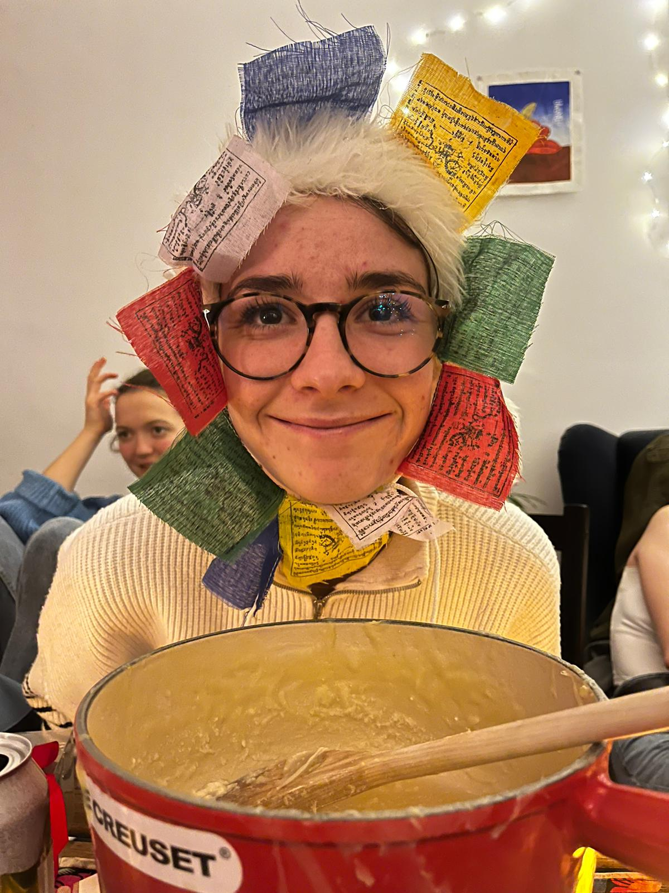

  <h2>Who am I?</h2>

  
  
  As a woman with a deep passion for cinema, I aspire to become a celebrated actress and make a lasting impact in the film industry. My journey, guided by strong values and ambition, takes a unique path through the enchanting world of cinema, each region sparkling with its own distinct characteristics. 
  Accompanied by a skilled team of data analysts, I navigate the cinematic landscape like a treasure map, seeking fame and impact. My goals are twofold: achieving personal success and advocating for female representation and equal opportunities in cinema. We explore the diverse landscape of the world's film industries, from Hollywood's glamour to Europe's cultural heritage and the dynamic energy of Bollywood in Asia, seeking to pinpoint where the most promising prospects for wealth, achievement, and fellowship are found.

  But let me first introduce my incredible data anylsts team:

  

    
    
Léon

    
Role 1

    
"Quotation from Léon"

  

  

    
    
Lola

    
Role 2

    
"Quotation from Lola"

  

  

    
    
Justine

    
Role 3

    
"Quotation from Justine"

  

  

    
    
Flore

    
Role 4

    
"Quotation from Flore"

  

  

    
    
Chléa

    
Role 5

    
"Quotation from Chléa"

  

Now, I'll let you dive into the report of my incredible team to find the secrets of cinematic success.

  Faithfully yours,

  NAME

  

